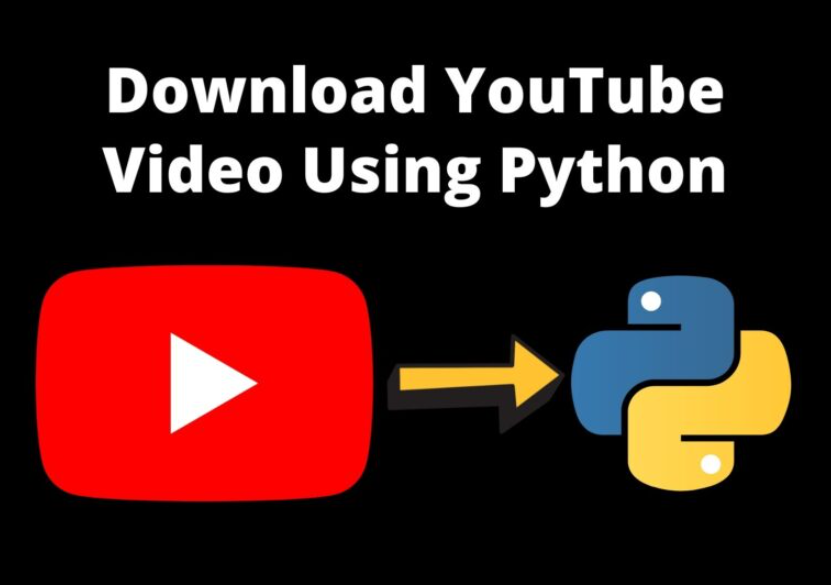

# Youtube Downloader Django  

## Descripción
El proyecto "YouTube Video Downloader" es una aplicación web fullstack que proporciona una interfaz de usuario limpia, informativa e interactiva para descargar videos de YouTube a través de un enlace de video. La aplicación permite a los usuarios ingresar el enlace del video de YouTube que desean descargar y luego proporciona opciones para seleccionar la calidad y el formato de descarga. Después de realizar la selección, los usuarios pueden iniciar la descarga y recibir el archivo de video descargado en su dispositivo local.

## Tecnologías utilizadas:
- Python: El lenguaje de programación principal utilizado en este proyecto. Python es ampliamente utilizado en el desarrollo web debido a su legibilidad y eficiencia.

- Django: Un framework web de Python que facilita el desarrollo rápido y seguro de aplicaciones web. Django proporciona una arquitectura MVC (Modelo-Vista-Controlador) y viene con muchas características útiles integradas, como enrutamiento, autenticación de usuarios y manipulación de formularios.

- YouTube API: Se utiliza la API de YouTube para obtener información sobre el video, como su título, duración y opciones de calidad. Esto se realiza a través de solicitudes HTTP utilizando bibliotecas de Python como requests.

- HTML/CSS: Se utiliza HTML para crear la estructura de la interfaz de usuario y CSS para diseñarla y darle estilo. Estas tecnologías permiten crear una interfaz atractiva y fácil de usar.

- JavaScript: Se utiliza JavaScript para agregar interactividad a la aplicación web. Esto incluye la manipulación del DOM (Document Object Model) y la implementación de funciones como la validación del formulario y las interacciones en tiempo real.

## Cómo ejecutar el proyecto
Para ejecutar YouTube Video Downloader, debes tener instalado Python en tu PC. Después de descargar el proyecto, sigue los siguientes pasos:

- Paso 1:
  Extrae/descomprime el archivo.

- Paso 2:
  Ingresa a la carpeta del proyecto, abre la terminal y escribe los siguientes comandos para instalar el framework Django y ejecutar el servidor web:

`` pip install -r requirements.txt ``

`` python manage.py runserver ``

- Paso 3:
  Finalmente, abre el navegador e ingresa a localhost:8000.

## Requisitos
Asegúrate de tener instalado lo siguiente:

- Python (versión especificada en requirements.txt)
- Django (instalado mediante el archivo requirements.txt)

## Notas
Este proyecto utiliza la biblioteca yt-downloader, la cual debes asegurarte de tener instalada para su correcto funcionamiento.
